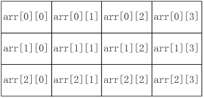

## 1. C 语言函数

### 1.1 什么是函数

**函数**是 C 编程的核心，用于完成一系列子任务的程序解决方案。 至此，你已经知道每个 C 程序都包含一个 `main()` 函数，并且已熟悉 `printf()` 函数。

你也可以创建自己的函数。

函数的**特点**：

- 是执行特定任务的代码块；
- 可重用；
- 使程序易于测试；
- 可以在不更改调用程序的情况下进行修改；

将 `main()` 分解为子任务，即使是简单的程序也更易于理解用功能实现的。

例如，下面程序计算一个数字的平方：

```c
int main() {
    int x, result;
    
    x = 5;
    // 可以很容易看出 该程序的目标是计算数字的平方
    result = square(x);
    printf("%d squared is %d\n", x, result);
    return 0;
}
```

为了使用 **square** 函数，我们需要声明它。

声明通常出现在 **main()** 函数的上方，形式如下：

```c
return_type function_name(parameters); 
```

- **return_type** 函数返回的值类型；
- **function_name** 函数名，后面有圆括号 `()`；
- **parameters** 带有类型声明的可选的参数，放在括号内 `()`。

::: warning

当函数不需要返回值时，但在声明中仍然必须有一个返回类型。这种情况下，使用关键字 **void**。

例如，**display_message** 函数声没有返回值:

```c
void display_message();
```

:::

**C 程序必须至少具有一个 `main()` 的函数?**

A. 错误

B. 正确

当声明中包含参数类型和名称时，该声明称为**函数原型**。

例如，**square** 函数原型出现在 `main()` 上面：

```c {3-4}
#include <stdio.h>

/* 声明 */
int square (int num);

int main() {
    int x, result;
    
    x = 5;
    result = square(x);
    printf("%d squared is %d\n", x, result);
    
    return 0;
} 
```

这里 **square** 函数返回一个整数，并接受一个 `int` 类型的参数。

最后一步实际上是定义功能。

函数的定义通常出现在 `main()` 函数之后。

下面的完整程序显示了 `square` 函数的声明和定义:

```c {16-23}
#include <stdio.h>

/* 函数声明 */
int square (int num);

int main() {
    int x, result;
  
    x = 5;
    result = square(x);
    printf("%d squared is %d\n", x, result);
    
    return 0;
}

/* 函数定义 */
int square (int num) {
    int y;

    y = num * num;

    return(y);
}
```

正如你所见，**square** 函数计算并返回其参数的平方。

一个函数可以接受**多个参数**--在这种情况下，它们必须用逗号 `,` 分隔。

**return** 语句将一个值返回给调用方。

**填空，声明一个 `triple` 的函数，该函数带有一个 `int` 参数并返回其值乘以 3：**

```c
int triple (___ num) {
    int y;
    y = num * 3;
}
```

### 1.2 函数参数

在调用函数时, 大多数情况下，主调函数和被调函数之间有数据传递关系，这就是有参数的函数形式。函数参数的作用是传递数据给函数使用，函数利用接收的数据进行具体的操作处理。

默认情况下，参数**按值传递**，这意味着将数据副本提供给被调用函数的参数。

实际变量未传递到函数中，因此函数内修改参数的值不会更改到外部对应变量的值。

传递给函数的参数按位置与参数匹配。因此，第一个参数传递给第一个参数，第二个参数传递给第二个参数，依此类推。

下面的程序演示了按值传递参数：

```c
#include <stdio.h>

int sum_up(int x, int y);

int main() {
    int x, y, result;

    x = 3;
    y = 12;
    result = sum_up(x, y);
    printf("%d + %d = %d", x, y, result);

    return 0;
}

int sum_up(int x, int y) {
    x += y;
    return (x);
} 
```

程序的输出:

```c
3 + 12 = 15
```

**x** 和 **y** 的值传递给 **sum_up**。

::: warning

请注意，即使参数 **x** 的值在 **sum_up** 中被改变，`main()` 中参数 **x** 的值也没有改变，因为仅将其值(副本)传递到了参数 **x** 中。

:::

**填空，声明带有两个 `float` 参数的函数 `test()`：**

```c
void test( ___  a, ___b);
```

### 1.3 变量作用域

**变量作用域**（Scope），就是变量的有效范围，就是变量可以在哪个范围以内使用。有些变量可以在所有代码文件中使用，有些变量只能在当前的文件中使用，有些变量只能在函数内部使用，有些变量只能在 for 循环内部使用。

**<span style="color: orange">变量的作用域由变量的定义位置决定，在不同位置定义的变量，它的作用域是不一样的。</span>**

- 在函数内声明的变量是该代码块的局部变量，不能在函数外部引用。

- 在所有函数外部声明的变量是整个程序的**全局变量**。

例如，在程序顶部用 `#define` 声明的常量对整个程序可见。

以下程序同时使用**局部**变量和**全局**变量：

```c
#include <stdio.h>

// 全局变量
int global1 = 0;

int main() {
    // 局部变量
    int local1, local2;

    local1 = 5;
    local2 = 10;
    global1 = local1 + local2;
    printf("%d \n", global1);  /* 15 */

    return 0;
}
```

当参数传递给函数参数时，参数作为局部变量。在退出函数后，参数和函数中的任何局部变量都被销毁。

::: warning

请谨慎使用全局变量。在使用它们之前，应先对其进行初始化，以避免意外结果。而且由于可以在程序中的任何地方更改它们，因此全局变量可能导致难以检测到错误(bug)。

:::

**变量作用域指的是?**

A. 程序中变量的有效可见范围

B. 程序中的变量数

C. 声明的函数数量

### 1.4 静态变量

**静态变量**具有局部作用域，但在退出函数时不会被销毁。因此，静态变量将在程序生命周期内保留其值，并且每次重新输入该函数时都可以访问该静态变量。

**<span style="color: orange">静态变量在声明时被初始化，且需要使用前缀 static 修饰。</span>**

下面的程序使用了一个静态变量：

```c
#include <stdio.h>

void say_hello();

int main() {
    int i;

    for (i = 0; i < 5; i++) {
        say_hello();
    }

    return 0;
}

void say_hello() {
    // 静态变量
    static int num_calls = 1;

    printf("Hello number %d\n", num_calls);
    num_calls++;
}
```

程序的输出：

```c
Hello number 1
Hello number 2
Hello number 3
Hello number 4
Hello number 5
```

**填空，声明静态整数变量 `var` 并将其初始化为值1：**

```c
___ int var ___ 1;
```

## 2. 递归函数

C 语言的函数都支持递归, 也就是说，每个函数都可以**直接**或者**间接**第调用自己。所谓的间接调用，是指在递归函数调用的下层函数中再调用自己。

递归之所以能实现，是因为函数的每个执行过程在栈中都有自己的形参和局部变量的副本，这些副本和该函数的其他执行过程不发生关系。

考虑一个数字的阶乘，通常写为 `5! = 5 * 4 * 3 * 2 * 1`。

也可以将此计算视为重复计算 `num * (num -1)` ，直到 `num` 为1。

递归函数是一个调用其自身的函数，它包括一个**退出条件**，用于结束递归调用。在计算阶乘时，退出条件为 `num` 等于1。

例如:

::: code-tabs

@tab while

```c
#include <stdio.h>

long long factorial_while(int n) {
    long long result = 1;
    while (n > 1) {
        result *= n;
        n--;
    }
    return result;
}

int main() {
    int num = 5;
    printf("Factorial of %d using while loop: %lld\n", num, factorial_while(num));
    return 0;
}
```

@tab for

```c
#include <stdio.h>

long long factorial_for(int n) {
    long long result = 1;
    for(int i = 1; i <= n; i++) {
        result *= i;
    }
    return result;
}

int main() {
    int num = 5;
    printf("Factorial of %d using for loop: %lld\n", num, factorial_for(num));
    return 0;
}
```

@tab 递归

```c
#include <stdio.h>

// 函数声明
int factorial(int num);

int main() {
    int x = 5;

    printf("The factorial of %d is %d\n", x, factorial(x));

    return 0;
}

// 函数定义
int factorial(int num) {

    if (num == 1)  /* 退出条件 */
        return (1);
    else
        return (num * factorial(num - 1));
} 

// 程序的输出："`The factorial of 5 is 120`"
```

:::


递归的工作方式是"堆叠"调用，直到基本情况被执行。在这一点上，调用从最新的到最旧的完成。如上代码，阶乘调用栈类似：

```c
2*factorial(1)
3*factorial(2)
4*factorial(3)
5*factorial(4)
```

当达到退出条件时，`factorial(1)` 返回 1 触发堆叠调用的完成。

从最新到最旧的返回值创建以下计算，最后计算的（5 * 24）返回到调用函数 `main()`：

```c
2 * 1
3 * 2
4 * 6
5 * 24
```

::: warning

递归函数需要一个基本退出条件，以防止出现无限循环。

运行代码，看看它是如何工作的!

---

由于阶乘的值很快增大，所以我使用了 `long long` 类型来存储结果，以防止溢出。但即使如此，对于非常大的整数，结果仍然可能会溢出。如果你想计算非常大的数字的阶乘，你可能需要使用一些特殊的库或手动实现大数运算。

:::

**填空，定义用于计算 n 阶乘的递归函数：**

```c
int fact(int n) {
    if (n == 1) {
        ___ 1;
    }
    return n * ___ (n - 1);
}
```

## 3. 数组 Array

### 3.1 数组概念

**数组**是一种数据结构，存储了所有**相同类型**的值集合。

数组很有用，因为可以用一个描述性名称表示相关数据，而不须分别命名单独的变量。

例如，数组 `test_scores[25]` 可以容纳 25 个考试分数。

### 3.2 数组的声明

数组声明包括其存储的值类型，标识符和带有表示数组大小的数字的方括号 `[]`。

**例如：**

```c
int test_scores[25]; /* 数组大小 25 */ 
```

你也可以在声明数组时对其进行初始化，如以下语句：

```c
float prices[5] = {3.2, 6.55, 10.49, 1.25, 0.99}; 
```

注意，初始值用逗号 `,` 隔开，并放在大括号 `{}` 内。

一个数组可以**部分初始化**，如：

```c
float prices[5] = {3.2, 6.55}; 
```

缺少的值为 0。

:::: warning

数组存储在**连续**的内存位置，在声明后不能改变大小。

::: details 

这个描述涉及到数组在 C 语言中的本质特性。

1. **数组存储在连续的内存位置**：这意味着当你在 C 语言中声明一个数组，例如 `int arr[5];`，这五个整数值将存储在连续的内存地址中。如果 `arr[0]` 的地址是 `0x1000`（假设的地址），那么 `arr[1]` 的地址可能是 `0x1004`（考虑到一个 `int` 通常为4字节）。这使得数组访问非常快，因为知道第一个元素的地址和数组的类型后，就可以通过简单的指针算术找到任何元素。

2. **在声明后不能改变大小**：当你声明了一个数组，例如 `int arr[5];`，你为这个数组分配了固定大小的内存（在这个例子中是5个整数）。这个大小在数组的生命周期中是固定的，不能在运行时改变。如果你需要更多的空间，你不能简单地“扩展”这个数组。相反，你需要声明一个新的、更大的数组并复制数据，或者考虑使用其他数据结构，例如链表或动态数组（例如 C 语言中的动态内存分配和 `realloc` 函数）。

这些特性意味着数组在某些情境中非常高效（例如，当你知道所需的确切大小时），但在其他情境中可能不那么灵活（例如，当你在运行时需要改变数据结构的大小时）。

1. **声明一个新的、更大的数组并复制数据**：

```c
#include <stdio.h>

int main() {
    int old_array[5] = {1, 2, 3, 4, 5};
    int new_array[10];

    for (int i = 0; i < 5; i++) {
        new_array[i] = old_array[i];
    }

    // 初始化新数组的其余元素，或做其他操作
    for (int i = 5; i < 10; i++) {
        new_array[i] = 0;
    }

    for (int i = 0; i < 10; i++) {
        printf("%d ", new_array[i]);
    }

    return 0;
}
```

2. **使用动态内存分配和 `realloc`**：

```c
#include <stdio.h>
#include <stdlib.h>

int main() {
    int *array = (int *) malloc(5 * sizeof(int)); // 分配初始大小
    if (!array) {
        printf("Memory allocation failed!");
        return 1;
    }

    for (int i = 0; i < 5; i++) {
        array[i] = i + 1;
    }

    // 重新分配内存以容纳更多的元素
    int *temp = (int *) realloc(array, 10 * sizeof(int));
    if (!temp) {
        printf("Memory reallocation failed!");
        free(array);
        return 1;
    }

    array = temp;

    // 初始化或修改新分配的内存部分
    for (int i = 5; i < 10; i++) {
        array[i] = 0;
    }

    for (int i = 0; i < 10; i++) {
        printf("%d ", array[i]);
    }

    free(array);

    return 0;
}
```

这两种方法都将原始数组的内容复制到一个更大的数组中，但第二种方法使用动态内存分配，并允许在运行时调整数组的大小。

:::

::::

---

当你在 C 语言中声明一个数组并没有为其提供初始值，该数组的元素会有一个“默认值”，但这并不意味着该值是确定的。事实上，对于自动存储期（通常是局部变量）的未初始化数组，其中的值是不确定的。但是，对于静态存储期（例如全局变量或使用 `static` 修饰符声明的变量）的未初始化数组，其元素会被初始化为零值。

以下是一个关于不同类型数组和它们的“默认值”的表格：

| 数组类型  | 默认数据（局部变量/自动存储期） | 默认数据（全局变量/静态存储期） |
| --------- | ------------------------------- | ------------------------------- |
| `int`     | 不确定                          | 0                               |
| `float`   | 不确定                          | 0.0                             |
| `double`  | 不确定                          | 0.0                             |
| `char`    | 不确定                          | '\0'                            |
| `pointer` | 不确定                          | NULL                            |

请注意，对于局部变量或自动存储期的未初始化数组，你不应该假设其中的值是0或任何其他具体的值。最好总是在使用前初始化你的变量，以避免不确定的行为。

---

**填空，声明大小为 4 的整数数组：**

```c
___ x ___ 4 ___ = {1, 2, 3, 4};
```

### 3.3 访问数组元素

数组的内容称为**元素**，每个元素都可以通过一个索引号来访问。 在 C 语言中，索引号从 **0** 开始。

一个有 5 个元素的数组，其索引号为 0、1、2、3、4。 考虑一个数组 `x`:

```c
int x[5] = {20, 45, 16, 18, 22}; 
```

其中索引对应的元素，如下：

```c
0 => [20]
1 => [45]
2 => [16]
3 => [18]
4 => [22]
```

要访问一个数组元素，请使用其索引号。

**例如：**

```c
#include <stdio.h>

int main() {
    int x[5] = {20, 45, 16, 18, 22};
    printf("The second element is %d\n", x[1]); /* 45 */ 
    
    return 0;
}
```

数组元素的值可以通过赋值语句来更改，这也需要使用数组名称和索引：

```c
#include <stdio.h>

int main() {
    int x[5] = {20, 45, 16, 18, 22};
    x[1] = 260;
    printf("The second element is %d\n", x[1]); /* 260 */
    
	return 0;
}
```

::: warning

数组的索引也称为**下标**。

:::

**填空, 打印数组 `x` 的第二个元素：**

```c
int x[5] = {20, 45, 16, 18, 22};
printf("%d", x[___]);
```

### 3.4 数组循环

许多算法要求访问数组的每个元素，以检查数据，存储信息或其他任务。

这可以通过遍历数组来完成，该过程通常使用 **for** 循环实现，因为循环控制变量自然对应于数组的索引。

考虑以下程序：

```c
#include <stdio.h>

int main() {
    float purchases[3] = {10.99, 14.25, 90.50};
    float total = 0;
    int k;

    /* 遍历 purchases，并累加 */
    for (k = 0; k < 3; k++) {
        total += purchases[k];
    }

    printf("Purchases total is %6.2f\n", total);
    /* Output:  Purchases total is 115.74 */

    return 0;
}
```

循环控制变量从 `0` 开始，达到数组大小时结束(注意是 `<数组大小` ，非 `<=数组大小` )

也可以通过循环，来改变数组的元素，例如：

```c
#include <stdio.h>

int main() {
    int a[10];
    int k;
    
    for (k = 0; k < 10; k++) {
        a[k] = k * 10;
    } 

    for (k = 0; k < 10; k++) {
        printf("%d \n", a[k]);
    }
   
	return 0;
}
```

**填空，使用 for 循环打印数组的元素：**

```c
int arr[5] = {1, 2, 3, 4, 5};
___ (int x = 0; x < ___; x++) {
    printf("%d", arr[___]);
}
```

### 3.5 数组长度

在 C 语言中，数组本身并不直接存储其长度信息。如果你定义了一个数组，但在其他地方你没有存储或保留它的长度，那么你无法直接从数组本身获取其长度。

但是，有一些常用的方法来获取数组长度，尤其是在定义数组的时候：

1. **使用 `sizeof` 运算符**：

  如果你在定义数组的地方，或者在某个范围内可以直接访问到数组的定义，你可以使用 `sizeof` 运算符来计算数组的长度。例如：

   ```c
   int arr[] = {1, 2, 3, 4, 5};
   int length = sizeof(arr) / sizeof(arr[0]);
   ```

   在这个例子中，`sizeof(arr)` 返回整个数组的字节大小，而 `sizeof(arr[0])` 返回数组中一个元素的字节大小。两者相除即可得到数组的长度。

2. **固定大小数组**：
    当你定义一个数组时，你可以指定其大小，并始终记住这个大小。例如，`int arr[10];` 表示一个包含 10 个整数的数组。

3. **结尾标记法**：
    对于某些特定类型的数组，例如字符串（字符数组），可以使用一个特殊的值（例如 `\0`）来表示数组的结束。通过遍历数组来查找这个特殊值，你可以确定数组的实际使用长度。但是，这种方法并不适用于所有类型的数组。

::: tabs

@tab 结尾标记法例子1

字符串在 C 语言中其实就是字符数组，并且已经内建了结尾标记法：每个字符串的结尾都有一个 `'\0'` 字符作为终止标记。

以下是获取字符串长度的代码示例，不使用 `strlen()` 函数：

```c
#include <stdio.h>

int main() {
    char str[] = "Hello, World!";
    int length = 0;

    while (str[length] != '\0') {
        length++;
    }

    printf("The length of the string is: %d\n", length);
    return 0;
}
```

上述代码将输出 "`The length of the string is: 13`"，因为字符串 "`Hello, World!`" 的长度是 13。

然而，在实际应用中，你可能会直接使用 C 标准库中的 `strlen()` 函数，因为它也是使用同样的方式来计算字符串长度的。

@tab 结尾标记法例子2

结尾标记法通常用于字符串，但这里我会展示一个整数数组的例子，其中我们将使用 `-1` 作为数组的结束标志。

首先是定义数组：

```c
#include <stdio.h>

int main() {
    int arr[] = {1, 2, 3, 4, 5, -1};  // 注意我们在最后放了一个-1作为标记
    int length = 0;

    for (int i = 0; arr[i] != -1; i++) {
        length++;
    }

    printf("The length of the array is: %d\n", length);
    return 0;
}
```

在上述代码中，我们遍历数组直到遇到 `-1` 这个标记，然后使用一个计数器来计算数组长度。

请注意，结尾标记法的缺点是你不能在数组中使用标记值作为其实际内容。在上述示例中，我们不能有 `-1` 作为数组的一个实际值，因为它被用作结束标记。在实践中，这可能会限制数组的使用，所以这种方法并不总是理想的选择。

@tab `strlen()` 函数

`strlen` 是 C 语言中的一个函数，用于获取 C 字符串（以 `\0` 结尾的字符数组）的长度。它位于头文件 `string.h` 中。

以下是 `strlen` 的基本用法：

```c
#include <stdio.h>
#include <string.h>

int main() {
    char str[] = "Hello, World!";
    int length;

    length = strlen(str);

    printf("The length of the string is: %d\n", length);

    return 0;
}
```

输出：
```
The length of the string is: 13
```

`strlen` 函数返回的是字符串中字符的数量，不包括结尾的 `\0`。所以上述示例中 "`Hello, World!`" 的长度是 13。

**注意：** 使用 `strlen` 时要确保传递的字符数组确实是一个以 `\0` 结尾的有效字符串。如果传递的字符数组没有以 `\0` 结尾，`strlen` 将会继续读取内存，直到找到一个 `\0`，这可能会导致未定义的行为或程序崩溃。

:::

如果你需要经常获取数组的长度，并且数组的大小可能发生变化，那么你可能需要考虑使用其他数据结构，例如链表或动态数组。在 C 标准库中，也有类似的数据结构，如 `malloc` 和 `realloc`，可以用来动态地分配和调整内存。

## 4. 二维数组

### 4.1 二维数组的概念

**二维数组**是数组的数组，可以认为是一个表格。也可以把二维数组看成国际象棋棋盘、城市街区等的网格。



### 4.2 二维数组的声明

二维数组声明需要给出行数和列数。 

**比如:**

```c
int a[2][3]; /*  2 x 3 的数组 */ 
```

嵌套花括号 `{}` 用于逐行初始化元素，如下语句:

```c
int a[2][3] = {
    {3, 2, 6},
    {4, 5, 20}
}; 
```

也可以采用以下形式：

```c
int a[2][3] = { {3, 2, 6}, {4, 5, 20} }; 
```

前者提供了更清晰的可视化阵列的结构。

::: warning

一个数组可以有两个以上的维度。

例如，`a[5][3][4]` 是一个有 5 个元素的数组，每个元素存储 3 个元素，且这三个元素的每个元素又存储 4 个元素。

```c
#include <stdio.h>

int main() {
    // 声明并初始化一个三维数组
    int a[5][3][4] = {
        {
            {1, 2, 3, 4},
            {5, 6, 7, 8},
            {9, 10, 11, 12}
        },
        {
            {13, 14, 15, 16},
            {17, 18, 19, 20},
            {21, 22, 23, 24}
        },
        // ... 可以继续添加更多的初始化值
    };

    // 以示例方式打印数组中的某个值
    printf("a[1][2][3] = %d\n", a[1][2][3]);  // 输出: a[1][2][3] = 24

    return 0;
}
```

:::

填空，下面二维数组有多少个元素？

```c
int arr[2][5];
```

### 4.3 访问二维数组

要访问二维数组的元素，需要行索引和列索引。 

例如，以下语句打印元素的值，然后分配一个新值：

```c
#include <stdio.h>

int main() {
    int a[2][3] = {
        {3, 2, 6},
        {4, 5, 20}
    };
    printf("Element 3 in row 2 is %d\n", a[1][2]); /* 20 */
    a[1][2] = 25;
    printf("Element 3 in row 2 is %d\n", a[1][2]); /* 25 */
   
	return 0;
}
```

就像 **for** 循环遍历一维数组一样，嵌套的 **for** 循环用来遍历二维数组：

```c
#include <stdio.h>

int main() {
    int a[2][3] = {
            {3, 2, 6},
            {4, 5, 20}
    };

    int k, j;
    /* 打印数组内容 */
    for (k = 0; k < 2; k++) {
        for (j = 0; j < 3; j++) {
            printf(" %d", a[k][j]);
        }
        printf("\n");
    }

    return 0;
}
```

**填空，计算和输出二维数组 `a` 中元素的总和:**

::: code-tabs

@tab Question

```c
#include <stdio.h>

int main() {
    int a[2][3] = {
            {3, 2, 6},
            {4, 5, 20}
    };
    int sum = 0;
    for (int k = 0; k < 2; k++) {
        ___ (int j = 0; j < 3; j++) {
            sum += a[___][___];
        }
    }
    printf("Sum: %d", ___);
    return 0;
}
```

@tab Answer

```c
#include <stdio.h>

int main() {
    int a[2][3] = {
            {3, 2, 6},
            {4, 5, 20}
    };
    int sum = 0;
    for (int k = 0; k < 2; k++) {
        for (int j = 0; j < 3; j++) {
            sum += a[k][j];
        }
    }
    printf("Sum: %d", sum);
    return 0;
}
```

:::

## 5. 指针

### 5.1 使用内存

C 被设计为一种低级语言，可以轻松访问内存位置并执行与内存相关的操作。

例如，`scanf()` 函数通过使用 `&` 符号将用户输入的值放在变量的位置或**地址**上。

**举例：**

```c
#include <stdio.h>

int main() {
    int num;
    printf("Enter a number: ");

    scanf("%d", &num);

    printf("%d", num);
    
	return 0;
}
```

`&num` 是变量 `num` 的地址。

内存地址是以**十六进制**数的形式给出的。**十六进制**，是一个基数为 16 的数字系统，用数字 `0` 到 `9` 和字母 `A` 到 `F`（16 个字符）来表示一组四位二进制数，其值可以从 `0` 到 `15`。

读取 32 位内存的 8 位十六进制数字要比尝试破译 32 位的二进制代码容易得多。

下面的程序打印变量 **i** 和 **k** 的内存地址:

```c
#include <stdio.h>

void test(int k);

int main() {
    int i = 0;

    printf("The address of i is %x\n", &i);
    test(i);
    printf("The address of i is %x\n", &i);
    test(i);

    return 0;
}

void test(int k) {
    printf("The address of k is %x\n", &k);
} 
```

在 `printf` 语句中，`%x` 是十六进制格式指定符。 程序输出因运行而异，但看起来类似：

```c
The address of i is 6faaf328
The address of k is 6faaf2ec
The address of i is 6faaf328
The address of k is 6faaf2ec
```

变量的地址从声明时起就保持不变，直到它的作用域结束。

**填空，打印变量 `var` 的 16 进制内存地址：**

```c
int var = 42;
printf("%___", ___ var)
```

### 5.2 什么是指针？

**指针**在 C 语言编程中非常重要，因为它们可以让你轻松地处理内存位置。 指针是数组，字符串以及其他数据结构和算法的基础。

一个**指针**是一个变量，它包含另一个变量的**地址**。换句话说，它 "指向"分配给一个变量的内存位置，并可以间接地访问该变量。

指针使用符号 `*` 声明，其形式为：

```c
pointer_type *identifier
```

- **`pointer_type`**: 指针将指向的数据类型。实际的指针数据类型是一个十六进制的数字，但是当声明一个指针时，你必须指出它将指向什么类型的数据。
- 星号 `*` 声明为一个指针，应该出现在用于指针变量的标识符旁边。

下面的程序演示了变量、指针和地址：

```c
#include <stdio.h>

int main() {
    int j = 63;
    int *p = NULL;
    p = &j;

    printf("The address of j is %x\n", &j);
    printf("p contains address %x\n", p);
    printf("The value of j is %d\n", j);
    printf("p is pointing to the value %d\n", *p);
}
```

关于这个程序，需要注意一下几点：

- 指针应该初始化为 **NULL**，直到它被分配到一个有效的位置。
- 指针可以使用 `&` 来获取一个变量的内存地址。
- 要看一个指针指向什么，再使用 `*`，如 `*p`。这种情况下，`*` 被称为间接或取消引用运算符。该过程称为取消引用。

**程序的输出类似于：**

```c
The address of j is 6ba8b32c
p contains address 6ba8b32c
The value of j is 63
p is pointing to the value 63
```

::: warning

一些算法使用指向指针的指针。这种类型的变量声明使用 `**`，并且可以分配另一个指针的地址，如下所示：

```c
int x = 12;
int *p = NULL
int **ptr = NULL;
p = &x;
ptr = &p;
```

:::

---

::: tip C 语言中 int *n; 这样声明的指针 n 默认是什么？

在 C 语言中，当你声明一个指针变量如 `int *n;`，它并没有被自动初始化为某个特定的值。其值是不确定的，通常称为“垃圾值”。这意味着指针可能指向任意内存地址，这可能是一个非法的地址。

试图在初始化之前使用这样的指针（例如，解引用它）是危险的，并且可能导致未定义的行为。

如果你想让指针有一个初始值，你可以初始化它为 `NULL`，这是一个特定的值，表示该指针不指向任何有效的内存地址：

```c
int *n = NULL;
```

使用 `NULL` 初始化指针是一个好习惯，因为你可以容易地检查一个指针是否已被赋值：

```c
if (n == NULL) {
    // 指针还没有被赋值
}
```

总之，未初始化的指针在 C 中是危险的，并且在使用它们之前，你应始终确保它们被赋予一个合适的值。

:::

**填空，声明指针变量 `ptr` 指向变量 `var`:**

```c
int var = 42;
int ___ ptr = ___ var;
```

### 5.3 表达式中的指针

指针可以在**表达式**中使用，就像任何变量一样。算术运算符可用于指针所指向的任何对象。

**例如：**

```c
#include <stdio.h>

int main() {
    int x = 5;
    int y;
    int *p = NULL;
    p = &x;

    y = *p + 2; /* y 被赋予 7 */
    y += *p;     /* y 被赋予 12 */
    *p = y;       /* x 被赋予 12 */
    (*p)++;      /* x 增加到 13 */

    printf("p 指向值 %d\n", *p);
    printf("x 指的值 %d\n", x);
}
```

::: warning

`++` 运算符需要括号才能增加所指向的值。使用 `--` 运算符时也是如此。

:::

**指针适用于哪个？**

A. 指针是无用的，使程序员陷入噩梦

B. 指针可以与任何变量一样在表达式中使用

C. 指针存储变量的值

## 6. 指针进阶

### 6.1 指针和数组

指针在数组中特别有用。

声明一个数组后就为其元素保留了一个连续的内存地址块。通过指针，可以指向数组第一个元素，然后使用**地址运算**来遍历数组。

- `+` 向前移动到一个内存位置
- `-` 向后移动到一个内存位置

**请看下面的程序：**

```c
#include <stdio.h>

int main() {
    int a[5] = {22, 33, 44, 55, 66};
    int *ptr = NULL;
    int i;

    ptr = a;
    for (i = 0; i < 5; i++) {
        printf("%d ", *(ptr + i));
    }
}
```

程序输出为：

```c
22 33 44 55 66 
```

数组的一个重要概念是: **数组名**作为一个**指针**已经指向数组的第一个元素。因此，语句 `*ptr = a` 等价于 `*ptr = &a[0]`。

如语句 `printf("%d", *a)` 将打印了数组的第一个元素。

**下面代码运行输出是？**

```c
int a[5] = {22, 33, 44, 55, 66};
int *ptr = a;
int res = *(ptr + 2);
printf("%d", res);
```

### 6.2 更多地址运算

地址运算也认为是指针运算，因为其操作涉及到指针。 除了使用 `+` 和 `-` 来指向下一个和上一个内存位置，你还可以使用赋值运算符来改变指针包含的地址。

**例如：**

```c
#include <stdio.h>

int main() {
    int a[5] = {22, 33, 44, 55, 66};
    int *ptr = NULL;
        
    ptr = a;  /* point to the first array element */
    printf("%d  %x\n", *ptr, ptr);  /* 22 */
    ptr++;
    printf("%d  %x\n", *ptr, ptr);  /* 33 */
    ptr += 3;
    printf("%d  %x\n", *ptr, ptr);  /* 66 */
    ptr--;
    printf("%d  %x\n", *ptr, ptr);  /* 55 */
    ptr -= 2;
    printf("%d  %x\n", *ptr, ptr);  /* 33 */ 
}
```

**程序输出类似于：**

```c
22  6fc3f310
33  6fc3f314
66  6fc3f320
55  6fc3f31c
33  6fc3f314
```

当一个指针被递增时，内存地址增加了指向变量的字节数。在上面的程序中，当使用自增运算符（`ptr++`）时，指针会增加 4 个字节，因为指针指向的是一个 `int` 类型变量。

::: warning

你也可以使用 `==`、`<` 和 `>` 运算符来比较指针地址。

:::

**填空，使用自增运算符增加指针 `ptr` 并输出存储的值：**

```c
int arr[] = {1, 2, 3};
int* ptr = arr;
ptr __;
printf("%d", ___);
```

### 6.3 指针及函数

指针大大扩展了函数的特性。我们不再局限于返回一个值。使用指针参数，函数可以更改实际数据，而不是数据副本。

为了改变变量的实际值，调用语句将地址传递给函数中的指针参数。

例如，以下程序交换两个值：

```c
#include <stdio.h>

void swap(int *num1, int *num2);

int main() {
    int x = 25;
    int y = 100;

    printf("x is %d, y is %d\n", x, y);
    swap(&x, &y);
    printf("x is %d, y is %d\n", x, y);

    return 0;
}

void swap(int *num1, int *num2) {
    int temp;

    temp = *num1;
    *num1 = *num2;
    *num2 = temp;
}
```

该程序交换了变量的实际值，因为该函数使用指针按地址访问它们。

输出：

```c
x is 25, y is 100
x is 100, y is 25
```

**下面代码的输出是哪一项？**

```c
#include <stdio.h>

void test(int *x) {
    *x += *x / 2;
}

int main() {
    int v = 8;
    test(&v);
    printf("%d", v);
}
```

A. 12

B. 8

C. 4

D. 6

## 7. 函数和数组

### 7.1 具有数组参数的函数

数组不能通过值传递给函数。但是，数组名是一个指针，因此仅将数组名传递给函数就是将指针传递给函数。

**请看下面的程序：**

```c
#include <stdio.h>

int add_up(int *a, int num_elements);

int main() {
    int orders[5] = {100, 220, 37, 16, 98};

    printf("Total orders is %d\n", add_up(orders, 5));

    return 0;
}

int add_up(int *a, int num_elements) {
    int total = 0;
    int k;

    for (k = 0; k < num_elements; k++) {
        total += a[k];
    }

    return (total);
}
```

程序输出："`Total orders is 471`"

**声明函数 `foo()`，该函数使用指针数组参数并返回 `int` 整数:**

```c
___ foo(int ___ arr);
```

### 7.2 返回数组的函数

就像一个数组的指针可以传入一个函数一样，一个数组的指针也可以被返回，如下面的程序:

```c
#include <stdio.h>

int *get_evens();

int main() {
    int *a;
    int k;

    a = get_evens(); /* get first 5 even numbers */
    for (k = 0; k < 5; k++)
        printf("%d\n", a[k]);

    return 0;
}

int *get_evens() {
    static int nums[5];
    int k;
    int even = 0;

    for (k = 0; k < 5; k++) {
        nums[k] = even += 2;
    }

    return (nums);
}
```

请注意，声明了一个指针（而不是数组）来存储该函数返回的值。

还要注意，当从函数传递局部变量时，需要在函数中将其声明为静态变量。

请记住，`a[k]` 与 `*(a + k)`相同。

**填空，声明一个返回 `int` 数组的函数:**

```c
int ___getArray();
```

## 8. 小测验

1. 声明一个带有两个 `int` 类型参数并返回浮点数（单精度）的函数：

```c
___ my_func(int a, ___ b);
```

2. 定义递归打印函数 `print`，该函数打印从 n 到 0 的数字：

```c
void print(int n) {
    if (n < 0) {
        ___;
    }
    printf("%d", n);
    ___ (n - 1);
}
```

::: details Answer

```c
#include <stdio.h>

void print(int n) {
    if (n < 0) {
        return;   // 退出递归
    }
    printf("%d\n", n);  // 打印当前数字n
    print(n - 1);       // 递归调用，参数减1
}

int main() {
    print(5);
    return 0;
}
```

:::

3. 填空，打印数组 `arr` 的元素：

```c
int arr[] = {1, 2, 3, 4, 5};
___ (int x = 0; x < 5; x++) {
    printf("%d", ___ [x]);
}
```

4. 填空，声明一个指向 `num` 变量的指针，并通过该指针将其值加倍。

```c
int num = 42;
int ___ ptr = ___ num;
___ ptr *= 2;
```

5. 填空，声明 `swap` 函数，该函数需要两个整数指针参数，并交换它们所指向的值。

```c
void swap(___ a, int *b) {
    int temp = *a;
    *a = *b;
    ___ b = temp;
}
```

6. 下面代码的输出是？

```c
int *test() {
    static int x[4];
    for (int i = 0; i < 4; i++) {
        x[i] = i % 2;
    }
    return x;
}

int main() {
    int *arr = test();
    printf("%d", *(arr + 3));
}
```


- [ ] 函数多个参数返回
- [ ] static 系统讲解、演示理解 static
- [ ] 递归函数中何时需要使用 return 来实现递归，何时不需要？
- [ ] 指针函数
- [ ] 函数必须要先声明吗？声明和不声明有什么区别？有什么优缺点？
- [ ] 静态变量的特点和动态变量的区别
- [ ] 数组循环添加数据
- [ ] C 语言函数参数不确定数量
- [ ] C 语言函数参数指定传入变量的值
- [ ] 函数和指针的参数什么时候需要 &，什么时候不需要 &
- [ ] 每种数据类型字节长度表格
- [ ] 数据循环添加数据 Ctrl + D 结束
- [x] 数组长度获取


::: details 公众号：AI悦创【二维码】


:::

::: info AI悦创·编程一对一

AI悦创·推出辅导班啦，包括「Python 语言辅导班、C++ 辅导班、java 辅导班、算法/数据结构辅导班、少儿编程、pygame 游戏开发、Linux、Web、Sql」，全部都是一对一教学：一对一辅导 + 一对一答疑 + 布置作业 + 项目实践等。当然，还有线下线上摄影课程、Photoshop、Premiere 一对一教学、QQ、微信在线，随时响应！微信：Jiabcdefh

C++ 信息奥赛题解，长期更新！长期招收一对一中小学信息奥赛集训，莆田、厦门地区有机会线下上门，其他地区线上。微信：Jiabcdefh

方法一：[QQ](http://wpa.qq.com/msgrd?v=3&uin=1432803776&site=qq&menu=yes)

方法二：微信：Jiabcdefh

:::


