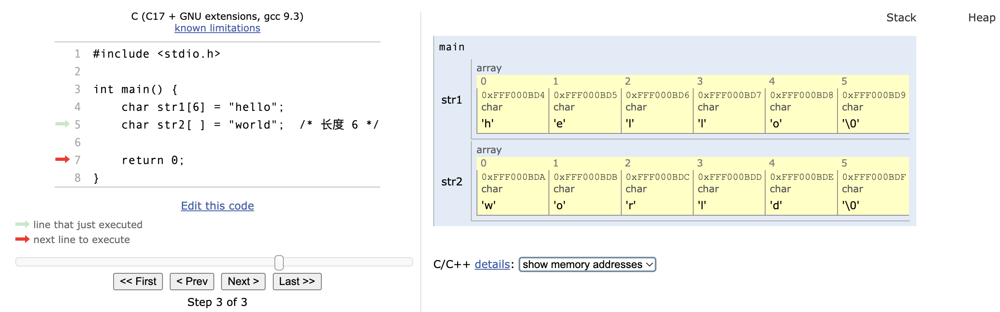

## 1. 字符串

### 1.1 字符串 String

C 中的**字符串**是一个以 **NULL** 字符 `\0` 结尾的字符数组。 字符串声明可以通过多种方式进行，每种方式都有各自考虑的因素。

**例如：**

```c
char str_name[str_len] = "string"; 
```

这将创建一个由 **str_len** 个字符组成的名为 **str_name** 的字符串，并将其初始化为值"string"。

提供字符串文本初始化字符串时，编译器会自动将 NULL 字符 `\0` 添加到字符数组**末尾**。

因此，声明数组大小至少比预期的字符串长度长一个字符。

下面的语句创建包含 NULL 字符的字符串。如果声明不包含 char 数组大小，则将根据初始化中字符串的长度加上 `\0` 的值来计算：

```c {4-6}
#include <stdio.h>

int main() {
    char str1[6] = "hello";
    char str2[ ] = "world";  /* 长度 6 */
    printf("str1 is: %s, str2 is: %s", str1, str2);
    
    return 0;
}
```




一个字符串也可以声明为一组字符，如下：

```c {4-6}
#include <stdio.h>

int main() {
    char str3[6] = {'h', 'e', 'l', 'l', 'o', '\0'};
    char str4[ ] = {'h', 'e', 'l', 'l', 'o', '\0'}; /* 大小 6 */
    printf("str3 is: %s, str4 is: %s", str3, str4);
    
    return 0;
}
```


使用这种方法，必须明确添加 NULL 字符 `\0` 。注意，**字符**是用单引号 `'` 括起来的。 与任何数组一样，字符串的名也为一个**指针**。 字符串是用双引号 `"` 括起来的文本。

一个字符，如 `'b'` ，用单引号表示，不能作为一个字符串处理。

字符串指针的声明，如 `char *str = "stuff";` 被认为是一个常量，不能改变其初始值。

为了安全和方便地操作字符串，你可以使用下面**标准库**中的字符串函数（不要忘记包括 `<string.h>` ）：

- `strlen()` - 获取字符串的长度
- `strcat()` - 连接两个字符串
- `strcpy()` - 将一个字符串复制到另一个
- `strlwr()` - 将字符串转换为小写字母
- `strupr()` - 将字符串转换为大写字母
- `strrev()` - 反转字符串
- `strcmp()` - 比较两个字符串

::: warning

字符串函数和字符串指针将在以后的课程中介绍。

:::

- 填空，将字符串声明为 char 数组：

```c
___ str[] = "Hello, world!";
```

### 1.2 字符串输入

程序通常是交互式的，要求用户输入。 为了从用户那里获取一行文本或其他字符串，C 提供了 `scanf()`、`gets()` 和 `fgets()` 函数。

你可以使用 `scanf()` 根据格式指定符来读取输入的字符串。

**例如：**

```c {4-7,9}
#include <stdio.h>

int main() {
    char first_name[25];
    int age;
    printf("Enter your first name and age: \n");
    scanf("%s %d", first_name, &age);
    
    printf("\nHi, %s. Your age is %d", first_name, age);
    
    return 0;
}
```

当 `scanf()` 用于读取字符串时，不需要用 `&` 访问变量地址，因为数组名 `first_name` 就是一个指针。

`scanf()` 在读到一个空格时就停止读取输入。

要读取一个有空格的字符串，请使用 `gets()` 函数。它读取输入，直到到达一个换行符 `\n`（按了 Enter 键）。

**例如：**

```c {4-6,8}
#include <stdio.h>

int main() {
    char full_name[50];
    printf("Enter your full name: ");
    gets(full_name);
    
    printf("\nHi, %s.", full_name);
    
    return 0;
}
```

替代 `gets()` 的一个更安全的方法是 `fgets()`，它最多读取指定数量的字符。

这种方法有助于防止**缓冲区溢出**，当字符串数组的大小不足以容纳输入的文本时，就会发生溢出。

**例如：**

```c {4-6,8}
#include <stdio.h>

int main() {
    char full_name[50];
    printf("Enter your full name: ");
    fgets(full_name, 50, stdin);

    printf("\nHi, %s", full_name);
    
    return 0;
}
```

`fgets()` 的参数是字符串名和读取的字符数，以及一个指向你想从哪里读取字符串的指针。`stdin` 意味着从**标准输入**，也就是从键盘上读取。

**gets** 和 **fgets** 之间的另一个区别是，换行符 `\n` **fgets** 会存储。

::: warning

`fgets()` 只从 **stdin** 中读取 **n-1** 个字符，因为必须为 `\0` 留出空间。

:::

- 填空，使用 `scanf` 函数从输入中读取字符串存储到 char 数组 `str` 中：

```c
___ str[20];
scanf("%s", ___ );
```

### 1.3 字符串输出

字符串输出由 `fputs()`、`puts()` 和 `printf()` 函数处理。

`fputs()` 需要字符串名和一个指向你想打印字符串的位置的指针。要打印到屏幕上，使用 **stdout**，指的是**标准输出**。 

**例如：**

```c
#include <stdio.h>

int main() {
    char city[40];
    printf("Enter your favorite city: ");
    gets(city);
    // Note: for safety, use
    // fgets(city, 40, stdin);
    fputs(city, stdout);
    printf(" is a fun city.");

    return 0;
} 
```

`puts()` 函数仅接受一个字符串参数，也可以用来显示输出。然而，它在输出中添加了一个换行。

**例如：**

```c
#include <stdio.h>
int main() {
    char city[40];
    printf("Enter your favorite city: ");
    gets(city);
    // Note: for safety, use
    // fgets(city, 40, stdin);
    
    puts(city);
    
    return 0;
}
```

- 填空，声明字符串，并使用 `fputs()` 函数将其输出到屏幕：

```c
___ name[] = "John Smith";
___ (___, stdout);
```

::: details

```c
char name[] = "John Smith";
fputs(name, stdout)
```

:::

## 2. 字符串函数

### 2.1 sprintf 和 sscanf 函数

可以使用 `sprintf()` 函数创建格式化的字符串。这对于用其他数据类型来构建字符串很有用。

**例如：**

```c
#include <stdio.h>
int main() {
    char info[100];
    char dept[ ] = "HR";
    int emp = 75;
    sprintf(info, "The %s dept has %d employees.", dept, emp);
    printf("%s\n", info);
    
    return 0;
} 
```

另一个有用的函数是 `sscanf()`，用于扫描字符串中的值。 该函数从字符串中读取值，并将其存储在相应的变量地址中。

**例如：**

```c
#include <stdio.h>
int main() {
    char info[ ] = "Snoqualmie WA 13190";
    char city[50];
    char state[50];
    int population;
    sscanf(info, "%s %s %d", city, state, &population);
    printf("%d people live in %s, %s.", population, city, state);
    
    return 0;
} 
```

### 2.2 string.h 标准库

**string.h** 库包含许多字符串函数。 在程序顶部的语句 `#include <string.h>` 使你能够访问以字符串函数：

- `strlen(str)` 返回存储在 `str` 中的字符串的长度，不包括 NULL 字符。
- `strcat(str1, str2)` 将 `str2` 追加（连接）到 `str1` 的末尾，并返回指向 `str1` 的指针。
- `strcpy(str1, str2)` 将 `str2` 复制到 `str1` 。此功能对于为字符串分配新值很有用。

下面的程序演示了 `string.h` 标准库中的函数：

```c
#include <stdio.h>
#include <string.h>

int main()
{
    char s1[50] = "The grey fox";
    char s2[ ] = " jumped.";
    
    strcat(s1, s2);
    printf("%s\n", s1);
    printf("Length of s1 is %d\n", strlen(s1));
    strcpy(s1, s2);
    printf("s1 is now %s \n", s1);

    return 0;
} 
```

附加的 **string.h** 函数还包括：

- `strncat(str1, str2, n)` 将 `str2` 的前 n 个字符追加（连接）到 `str1` 的末尾，并返回指向 `str1` 的指针。
- `strncpy(str1, str2, n)` 将 `str2` 的前 n 个字符复制到 `str1`。
- `strcmp(str1, str2)` 当 `str1` 等于 `str2` 时返回 0，在 `str1 <str2` 时返回小于 0，在 `str1> str2` 时返回大于0。
- `strncmp(str1, str2, n)` 当 `str1` 的前 n 个字符等于`str2`的前n个字符时，返回 0；当 `str1 <str2` 时，小于0；当 `str1> str2` 时，大于 0。
- `strchr(str1, c)` 返回指向 `str1` 中首次出现的 char c 的指针，如果找不到字符，则返回 NULL。
- `strrchr(str1,c)` 反向搜索 `str1` 并返回一个指向 char c 在 `str1` 中位置的指针；如果找不到字符，则返回 NULL。
- `strstr(str1,str2)` 返回指向 `str1` 中首次出现的 `str2` 的指针，如果未找到 `str2`，则返回 NULL。

### 2.3 字符串转换为数字

在 C 语言编程中，将数字字符串转换为数值是 C 编程中的常见任务，通常用于防止运行时错。

比如当期望用户输入的字符串代表一个数字时，用户可能不小心键入“`o`”而不是“`0`”（零）。

**stdlib.h** 库包含以下函数，用于将字符串转换为数字：

- `int atoi(str)` 代表 ASCII 转成整数。将 `str` 转换为等效的 `int` 值。如果第一个字符不是数字或未遇到任何数字，则返回 0。
- `double atof(str)` 表示 ASCII 转成浮点数。将`str`转换为等效的 `double` 值。如果第一个字符不是数字或未遇到数字，则返回 0.0。
- `long int atol(str)` 表示 ASCII 转成 `long int` 。将 `str` 转换为等效的长整数。如果第一个字符不是数字或未遇到任何数字，则返回 0。

下面的程序演示了 **atoi**:

```c
#include <stdio.h>
#include <stdlib.h>
int main()
{
    char input[10 ];
    int num;


    printf("Enter a number: ");
    gets(input);
    num = atoi(input);

    printf("You entered %d", num);

    return 0;
}
```

::: warning

注意，`atoi()` 缺乏错误处理，如果你想确保进行适当的错误处理，建议使用 `strtol()`。

:::

- 填空，将字符串转换为整数：

```c
char str_num[] = "123";
int num = ___ (str_num);
printf("%d", num);
```

### 2.4 字符串数组

二维数组可用于存储相关的字符串。

以下语句，该语句声明一个包含 3 个元素的数组，每个元素包含 15 个字符：

```c
char trip[3][15] = {
    "suitcase",
    "passport",
    "ticket"
};
```

虽然字符串的长度不同，但有必要声明一个**足够大**的尺寸来容纳最长的字符串。此外，访问这些元素会非常麻烦。

引用 `trip[0]` 表示“suitcase”容易出错。相反，您必须将 `[0][0]` 处的元素视为 “s”，将 `[2][3]` 处的元素视为 “k”，依此类推

处理字符串集合的一种更简单，更直观的方法是使用指针数组，如以下程序所示：

```c
#include <stdio.h>

int main() {
    char *trip[ ] = {
        "suitcase",
        "passport",
        "ticket"
    };
    
    printf("Please bring the following:\n");
    
    for (int i = 0; i < 3; i++) {
        printf("%s\n", trip[i]);
    } 
    return 0;
} 
```

因为每个元素的长度都可以变化，所以与二维网格结构相比，字符串指针数组的结构更加参差不齐。

采用这种方法，字符串的长度没有限制。而且更重要的是，可以通过每个字符串的第一个字符的指针来引用。

请记住，像 `char *items[3];` 这样的声明只是为三个指针保留了空间。实际的字符串是由这些指针引用的。

- 填空，声明字符串数组：

```c
___  *names ___ = {
    "John",
    "Jill",
    "Janet"
};
```

::: details

```c
char *names[] = {
    "John",
    "Jill",
    "Janet"
};
```

:::

## 3. 函数指针

### 3.1 函数指针

由于指针可以指向任何内存位置的地址，它们也可以指向可执行代码的入口。

指向函数的指针，指向了内存中某个函数的可执行代码入口。函数指针可以存储在一个数组中，或作为参数传递给其他函数。

一个函数指针的**声明**就像你对任何指针一样使用：

```c
return_type (*func_name)(parameters) 
```

`(*func_name)` 周围的括号 `()` 很重要。没有它们，编译器会认为该函数返回的是一个指针。

在声明了**函数指针**后，你必须把它分配(即指向)给一个函数。

下面简短的程序声明了一个函数 `say_hello`，声明了一个函数指针 `funptr`，将该函数指针指向该函数，然后通过该指针调用函数：

```c
#include <stdio.h>
void say_hello(int num_times); /* 函数 */

int main() {
    void (*funptr)(int);  /* 函数 */
    funptr = say_hello; /* 指针赋值 */
    funptr(3); /* 调用函数 */
    
    return 0;
}

void say_hello(int num_times) {
    int k;
    for (k = 0; k < num_times; k++)
        printf("Hello\n");
}
```

一个函数名指向可执行代码的入口，就像一个数组名指向其第一个元素一样。

因此，尽管像 `funptr = &say_hello` 和 `(*funptr)(3)` 这样的语句是正确的，但在函数指针赋值和函数调用中没有必要包括地址运算符 `&` 和间接运算符 `*`。

- 填空，声明一个函数 `sum`，该函数返回其参数之和，并声明一个指向 `sum` 的函数指针 `psum`:

```c
int sum(int a, int b) {
    return a ___ b;
}

int (___ psum)(int, ___ ) = ___;
```

::: details


:::

### 3.2 函数指针数组

一个函数指针数组可以代替 **switch** 或 **if** 语句来选择分支，如下面的程序：

```c
#include <stdio.h>

int add(int num1, int num2);

int subtract(int num1, int num2);

int multiply(int num1, int num2);

int divide(int num1, int num2);

int main() {
    int x, y, choice, result;
    int (*op[4])(int, int);

    op[0] = add;
    op[1] = subtract;
    op[2] = multiply;
    op[3] = divide;
    printf("Enter two integers: ");
    scanf("%d%d", &x, &y);
    printf("Enter 0 to add, 1 to subtract, 2 to multiply, or 3 to divide: ");
    scanf("%d", &choice);
    result = op[choice](x, y);
    printf("\n %d", result);

    return 0;
}

int add(int x, int y) {
    return (x + y);
}

int subtract(int x, int y) {
    return (x - y);
}

int multiply(int x, int y) {
    return (x * y);
}

int divide(int x, int y) {
    if (y != 0)
        return (x / y);
    else
        return 0;
} 
```

- 填空，调用 `funcs` 数组指向的函数:

```c
// 假设 f1, f2, and f3 函数已被声明
void (*funcs[3])() = {f1, f2, f3};
for (int ix = 0; ix < ___; ix++) {
    ___[ix](); 
}
```

::: details


:::

## 4. 空指针

### 4.1 空指针

一个 **void** 空指针用来指向内存中的任何地址类型，它的声明看起来像：

```c
void *ptr;
```

下面的程序对三种不同的数据类型使用同一个指针。

```c
#include <stdio.h>

int main() {
    int x = 33;
    float y = 12.4;
    char c = 'a';
    void *ptr; // 空指针
  
    ptr = &x;
    printf("void ptr points to %d\n", *((int *)ptr));
    ptr = &y;
    printf("void ptr points to %f\n", *((float *)ptr));
    ptr = &c;
    printf("void ptr points to %c", *((char *)ptr));

    return 0;
}
```

取消引用空指针时，必须先使用类型将指针转换为适当的数据类型，然后再使用 `*` 取消引用。

::: warning

你不能对无效指针进行指针运算。

:::

- 打印空 `ptr` 指针指向的变量 `num` 的值:

```c
int num = 42;
___  *ptr =  &num;
printf("%d", *((int *)___));
```

::: details


:::

### 4.2 使用空指针的函数

空指针通常用于函数声明。

例如:

```c
void * square (const void *); 
```

使用 `void *` 返回类型允许任何返回类型。同样，`void *` 的参数可以接受任何参数类型。

如果要使用参数传递的数据而不更改它，则将其声明为 **const**。

你可以省略参数名，以进一步使声明与其实现的隔离。通过这种方式声明一个函数，可以根据需要自定义，而不必更改声明。

**考虑下面的程序：**

```c
#include <stdio.h>

void *square(const void *num);

int main() {
    int x, sq_int;
    x = 6;
    sq_int = square(&x);
    printf("%d squared is %d\n", x, sq_int);

    return 0;
}

void *square(const void *num) {
    static int result;

    result = (*(int *) num) * (*(int *) num);
    return (result);
} 
```

`square` 函数需要 `int` 类型，这就是为什么将 `num` void 指针强制转换为 `int` 的原因。

如果改变实现，允许 `square()` 乘以 **float**，那么只需要改变定义，而不需要改变声明。

- 填空，声明一个接受并返回 void 指针的函数：

```c
___  * foo(void ___);
void  * foo(void *);
```

### 4.3 函数指针作为参数

使用函数指针的另一种方法是将其作为参数传递给另一个函数。

用作参数的函数指针有时称为**回调函数**，因为接收函数会“回调它”。

`stdlib.h`头文件中的 `qsort()` 函数使用此技术。

quicksort是一种广泛用于对数组进行排序的算法。

要在程序中实现排序，只需包含 `stdlib.h` 文件，然后编写一个与 `qsort` 中使用的声明匹配的比较函数：

```c
void qsort(void *base, size_t num, size_t width, int (*compare)(const void *, const void *)) 
```

来分解 **qsort** 声明：

- `void *base` 指向要排序的数组的第一个元素的指针。
- `size_t num` 数组中的元素数量。
- `size_t width` 数组中每个元素的大小，以字节为单位。
- `int (*compare)(const void *, const void *)` 用来比较两个元素的函数，即函数指针（回调函数）。

**回调函数**： 回调函数就是一个通过函数指针调用的函数。如果把函数的指针（地址）作为参数传递给另一个函数，当这个指针被用来调用其所指向的函数时，就说这是回调函数。

**compar 参数**:

`compar` 参数指向一个比较两个元素的函数。比较函数的原型应该像下面这样。注意两个形参必须是 `const void *` 型，同时在调用 `compar` 函数时，传入的实参也必须转换成 `const void *` 型。在 compar 函数内部会将 `const void *` 转换成实际类型。

```c
int compar(const void *p1, const void *p2);
```

- 如果 compar 返回值小于 0（< 0），那么 p1 所指向元素会被排在 p2 所指向元素的前面；
- 如果 compar 返回值等于 0（= 0），那么p1所指向元素与 p2 所指向元素的顺序不确定；
- 如果 compar 返回值大于 0（> 0），那么p1所指向元素会被排在 p2 所指向元素的后面。

下面的程序使用 **qsort** 对一个 **int**  数组从低到高进行排序。

::: code-tabs

@tab code

```c
#include <stdio.h>
#include <stdlib.h>

int compare (const void *, const void *); 

int main() {
    int arr[5] = {52, 23, 56, 19, 4};
    int num, width, i;
  
    num = sizeof(arr)/sizeof(arr[0]);
    width = sizeof(arr[0]);
    qsort((void *)arr, num, width, compare);
    for (i = 0; i < 5; i++)
        printf("%d ", arr[ i ]);
    
    return 0;
}

int compare (const void *elem1, const void *elem2) {
    if ((*(int *)elem1) == (*(int *)elem2))
        return 0;
    else if ((*(int *)elem1) < (*(int *)elem2))
        return -1;
    else
        return 1;
} 
```

@tab 注释

```c
#include <stdio.h>   // 包含标准输入输出库，为 printf 函数提供支持
#include <stdlib.h>  // 包含标准库，为 qsort 函数提供支持

// 函数声明。此函数将用于 qsort 函数进行比较
int compare(const void *, const void *);

int main() {
    int arr[5] = {52, 23, 56, 19, 4}; // 定义并初始化一个含有 5 个整数的数组
    int num, width, i;

    num = sizeof(arr) / sizeof(arr[0]);   // 计算数组中的元素数量
    width = sizeof(arr[0]);               // 计算单个数组元素的大小（在此处为 int 的大小）

    // 使用 qsort 函数对数组进行排序
    // arr 为数组的指针，num 为元素数量，width 为单个元素的大小，compare 为比较函数
    qsort((void *)arr, num, width, compare);

    // 遍历并打印排序后的数组
    for (i = 0; i < 5; i++)
        printf("%d ", arr[i]);

    return 0; // 主函数结束，返回 0
}

// 比较函数，用于确定两个元素的相对顺序
int compare(const void *elem1, const void *elem2) {
    // 转换为 int 指针并解引用，获取整数值
    if ((*(int *)elem1) == (*(int *)elem2)) // 如果两数相等，返回 0
        return 0;
    else if ((*(int *)elem1) < (*(int *)elem2)) // 如果第一个数小于第二个数，返回 -1
        return -1;
    else // 如果第一个数大于第二个数，返回 1
        return 1;
}
```

:::

我们在 qsort 调用中使用了函数名，因为函数名充当了指针。

## 5. 小测验

1. 填空，声明两个字符串，并使用 `scanf()` 函数从输入中赋值：

```c
___ str1[20];
char str2[30];
___ ("%s ___ ", str1, str2);
```

::: details

```c
char
scanf
%s
```

:::

2. 使用 `atoi` 函数将输入字符串并转换为数字。

```c
___ number[10];
gets(___);
int result = ___ (number);
```

::: details

```c
char 
number
atoi
```

:::

3. 填空，声明一个函数，该函数返回其参数的平方，并使用函数指针进行调用：

```c
int sqr(int n) {
    ___ n * n;
}
int (___fp)(int) = sqr;
int x = fp(____);
```

::: details

```c
return
*
42
```

:::

4. 填空，通过 void 指针将变量 `num` 的值增加三倍。

```c
float num = 3.14;
___ *ptr = ___ num;
___ ((float*)ptr) *= 3;
```

::: details 

```c
void
&
*
```

:::

5. 填空，声明一个指向 `x1`，`x2` 和 `x3` 的空指针数组，并使用 `printf` 打印这些指针指向的值：

```c
int x1 = 42;
float x2 = 3.14;
char x3 = 'a';
void* arr[] = {&x1, &x2, ___x3};
___ ("%d %f %c", *((___*)arr[0]), ___((float*)arr[1]),  *((___*)arr[2]));
```

::: details 


:::


::: details 公众号：AI悦创【二维码】


:::

::: info AI悦创·编程一对一

AI悦创·推出辅导班啦，包括「Python 语言辅导班、C++ 辅导班、java 辅导班、算法/数据结构辅导班、少儿编程、pygame 游戏开发、Linux、Web、Sql」，全部都是一对一教学：一对一辅导 + 一对一答疑 + 布置作业 + 项目实践等。当然，还有线下线上摄影课程、Photoshop、Premiere 一对一教学、QQ、微信在线，随时响应！微信：Jiabcdefh

C++ 信息奥赛题解，长期更新！长期招收一对一中小学信息奥赛集训，莆田、厦门地区有机会线下上门，其他地区线上。微信：Jiabcdefh

方法一：[QQ](http://wpa.qq.com/msgrd?v=3&uin=1432803776&site=qq&menu=yes)

方法二：微信：Jiabcdefh

:::


