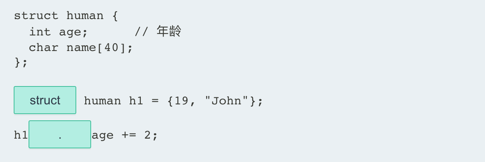
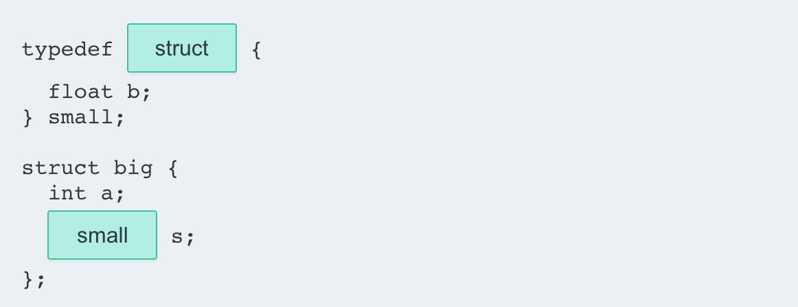

## 1. 结构体 struct

### 1.1 结构体

一个**结构体**( struct )是**用户自定义**的数据类型，将不同数据类型的相关变量组合在一起。

结构体的**声明**使用关键字 **struct**，以及带有变量声明列表的大括号 `{}`，称为**成员**。

**例如：**

```c
// 课程结构体
struct course {
    int id;                 // 课程 ID
    char title[40];      // 课程名
    float hours;        // 课程时长
}; 
```

该结构体语句定义了一个新数据类型 `course`，它有三个成员。 结构体成员可以是任何数据类型，包括基本类型、字符串、数组、指针，甚至其他结构，你将在后面的课程中学习。

::: warning

不要忘了在结构体声明后面加一个分号 `;`。 结构体也称为**复合**或**集合**数据类型。有些语言将结构体称为**记录**。

:::

- 填空，声明结构体 `human`:

```c
___human {
    int age;
    char name[40]; 
}
```

> struct
>
> ;

### 1.2 结构体变量的定义

要声明结构体数据类型的变量，请使用关键字 **struct**，后跟 struct 标记，然后变量名。

例如，下面的语句声明了一个结构数据类型，然后使用 **student** 结构来声明变量 **s1** 和 **s2**。

::: code-tabs

@tab Code

```c
#include <stdio.h>

struct student {
    int age;
    int grade;
    char name[40];
};

int main() {
    /* 声明结构体变量 */
    struct student s1;
    struct student s2;
    
    s1.age = 19;
    s1.grade = 9;
    sprintf(s1.name, "John Bighimer");
    
    s2.age = 22;
    s2.grade = 10;
    sprintf(s2.name, "Batman Jokerson");
    
    printf("Student: %s, %d\n", s1.name, s1.age);
    printf("Student: %s, %d\n", s2.name, s2.age);
    
    return 0;
}
```

@tab 注释

```c
#include <stdio.h>   // 包含标准输入输出库，为 printf 和 sprintf 函数提供支持

/* 定义结构体类型，描述学生信息 */
struct student {
    int age;           // 学生的年龄
    int grade;         // 学生的年级
    char name[40];     // 学生的名字，最大长度为 39 字符（因为最后一个字符是字符串终止符 '\0'）
};

int main() {
    /* 在 main 函数内部声明两个结构体变量 */
    struct student s1; // 第一个学生
    struct student s2; // 第二个学生
    
    /* 为第一个学生赋值 */
    s1.age = 19;                  // 设置年龄
    s1.grade = 9;                 // 设置年级
    sprintf(s1.name, "John Bighimer"); // 使用 sprintf 函数为名字赋值
    
    /* 为第二个学生赋值 */
    s2.age = 22;                  // 设置年龄
    s2.grade = 10;                // 设置年级
    sprintf(s2.name, "Batman Jokerson"); // 使用 sprintf 函数为名字赋值
    
    /* 打印两个学生的信息 */
    printf("Student: %s, %d\n", s1.name, s1.age); // 打印第一个学生的名字和年龄
    printf("Student: %s, %d\n", s2.name, s2.age); // 打印第二个学生的名字和年龄
    
    return 0;  // 主函数结束，返回 0
}
```

:::

::: warning

一个结构体变量存储在一个**连续**的内存块中。必须使用 **sizeof** 操作符来获取结构体所需的字节数，就像使用基本数据类型一样。

:::

1. 填空，声明一个结构体变量 `h1`:

```c
struct human {
    int age;
    char name[40];
};
___ human h1;
```

> struct

### 1.3 声明结构体变量

结构体变量也可以在声明中进行初始化，在大括号 `{}` 内按顺序列出初始值：

```c
#include <stdio.h>

struct student {
    int age;
    int grade;
    char name[40];
};

int main() {
    /* declare two variables */
    struct student s1 = {19, 9, "John Birghimer"};
    struct student s2 = {22, 10, "Batman Jokerson"};
    
    printf("Student: %s, %d\n", s1.name, s1.age);
    printf("Student: %s, %d\n", s2.name, s2.age);
    
    return 0;
}
```

如果你想在声明后使用大括号 `{}` 来初始化一个结构，则还需要写明**类型转换**，如以下语句所示：

```c
#include <stdio.h>

struct student {
    int age;
    int grade;
    char name[40];
};

int main() {
    struct student s1; // 声明结构体变量
    
    // 类型转换声明
    s1= (struct student){19, 9, "John Birghimer"};
    
    printf("Student: %s, %d\n", s1.name, s1.age);
    
    return 0;
}
```

你可以在初始化结构体变量时使用命名的成员来初始化相应的成员：

```c {10}
#include <stdio.h>

struct student {
    int age;
    int grade;
    char name[40];
};

int main() {
    struct student s1 = { .grade = 9, .age = 19, .name = "John Birghimer"};
    
    printf("Name: %s, Age: %d, Grade: %d\n", s1.name, s1.age, s1.grade);
    
    return 0;
}
```

在上面的例子中，`.grade` 指的是结构中的 `grade` 成员。同样地，`.age` 和 `.name` 指的是 `age` 和 `name` 成员。

- 填空，使用类型转换初始化 struct 变量 `h1`：

```c
struct human h1;
h1 = (___human) {19, "John"};
```

### 1.4 结构体变量的引用

可以通过在变量名和成员名之间使用点运算符`.`来访问结构体的成员变量。

例如，要给 **s1** 结构体变量的 **age** 成员赋值，可以使用如下语句：

```c
s1.age = 19;
```

你也可以把一个结构赋值给另一个同类型的结构。

```c {10-11,14}
#include <stdio.h>

struct student {
    int age;
    int grade;
    char name[40];
};

int main() {
    struct student s1 = {19, 9, "Jason"};
    struct student s2;
    
    printf("Assigning, s2 = s1\n");
    s2 = s1;
    
    printf("Results, Name: %s, Age: %d, Grade: %d\n", s2.name, s2.age, s2.grade);
    
    return 0;
}
```

下面的代码演示了使用一个结构：

```c
#include <stdio.h>
#include <string.h>

struct course {
    int id;
    char title[40];
    float hours;
};

int main() {
    struct course cs1 = {341279, "Intro to C++", 12.5};
    struct course cs2;

    /* 初始化 cs2 */
    cs2.id = 341281;
    strcpy(cs2.title, "Advanced C++");
    cs2.hours = 14.25;

    /* 打印成员信息 */
    printf("%d\t%s\t%4.2f\n", cs1.id, cs1.title, cs1.hours);
    printf("%d\t%s\t%4.2f\n", cs2.id, cs2.title, cs2.hours);

    return 0;
}
```

字符串赋值需要来自 `string.h` 库的 `strcpy()`。 还要注意格式指定符 `%4.2f` 包括宽度和精度选项。

- 填空，将变量 `h` 的年龄增加2岁：

```c
struct human {
  int age;      // 年龄
  char name[40];
};
___human h1 = {19, "John"}; 
h1___age += 2;
```

::: details Answer



:::

### 1.5 使用 typedef

**typedef** 关键字 创建一个类型定义，该定义可简化代码并使程序更易于阅读。

**typedef** 通常与结构体一起使用，因为它消除了在声明变量时使用关键字 struct 的需要。

例如:

```c {4-8,11-12}
#include <stdio.h>
#include <string.h>

typedef struct {
    int id;
    char title[40];
    float hours; 
} course;

int main() {
    course cs1;
    course cs2;

    cs1.id = 123456;
    strcpy(cs1.title, "JavaScript Basics");
    cs1.hours = 12.30;

    /* 初始化 cs2 */
    cs2.id = 341281;
    strcpy(cs2.title, "Advanced C++");
    cs2.hours = 14.25;
       
    /* 打印信息 */
    printf("%d\t%s\t%4.2f\n", cs1.id, cs1.title, cs1.hours);
    printf("%d\t%s\t%4.2f\n", cs2.id, cs2.title, cs2.hours);
  
    return 0;
}
```

注意，不再使用结构标签，而是在结构声明之前显示 typedef 名称。

现在，变量声明中不再需要使用 struct 一词，从而使代码更简洁，更易于阅读。

- 填空，使用 **typedef** 关键字声明"human"结构":

```c
___struct {
  int age;
  char name[40];
}___;
```

## 2. 结构体的妙用

### 2.1 结构体中的结构

一个结构体的成员也可以是结构体。 例如，考虑以下代码：

```c {3-6,8-11}
#include <stdio.h>

typedef struct {
  int x;
  int y;
} point;

typedef struct {
  float radius;
  point center;
} circle; 

int main() {
    point p;
    p.x = 3;
    p.y = 4;
    
    circle c;
    c.radius = 3.14;
    c.center = p;
    
    printf("Circle radius is %.2f, center is at (%d, %d)", c.radius, c.center.x, c.center.y);
  
    return 0;
}
```

嵌套的大括号 `{}` 用来初始化属于结构的成员。`.`  点运算符被两次用于访问成员的成员，如语句中:

```c {14-16}
#include <stdio.h>

typedef struct {
  int x;
  int y;
} point;

typedef struct {
  float radius;
  point center;
} circle; 

int main() {
    circle c = {4.5, {1, 3}};
    printf("%3.1f %d,%d", c.radius, c.center.x, c.center.y);
    /* 4.5  1,3 */
  
    return 0;
}
```

::: warning

一个结构体的定义必须先出现，然后才能在另一个结构体中使用。

:::

- 填空，定义一个 `small` 结构体类型，并在结构体 `big` 中将成员变量 `s` 声明为 `small` 类型：

```c
typedef ___{
    float b;
} small;

struct big {
    int a;
    ___s;
};
```

::: details Answer



:::

### 2.2 结构体指针

就像变量的指针一样，结构的指针也可以被定义。

```c
struct myStruct *struct_ptr;
```

定义了一个指向 *myStruct* 结构体的指针。

```c
struct_ptr = &struct_var;
```

将结构变量 `struct_var` 的地址存储在指针 `struct_ptr` 中。

```c
struct_ptr -> struct_mem;
```

访问结构成员 `struct_mem` 的值。

**例如：**

```c
#include <stdio.h>
#include <string.h>

// Student 结构体定义
struct student{
    char name[50];
    int number;
    int age;
};

// 结构体指针作为函数参数
void showStudentData(struct student *st) {
    printf("\nStudent:\n");
    printf("Name: %s\n", st->name);
    printf("Number: %d\n", st->number);
    printf("Age: %d\n", st->age);
}

int main() {
    // New Student Record Creation
    struct student st1;
    struct student st2;
    
    // Filling Student 1 Details
    strcpy(st1.name, "Krishna");
    st1.number = 5;
    st1.age = 21;
    
    // Filling Student 2 Details
    strcpy(st2.name, "Max");
    st2.number = 9;
    st2.age = 15;
    
    // Displaying Student 1 Details
    showStudentData(&st1);
    
    // Displaying Student 2 Details
    showStudentData(&st2);
    
    return 0;
}
```

`->` 操作符允许通过指针访问结构体的成员。

::: warning

`(*st).age` 与 `st->age` 相同。 同样，当使用 **typedef** 命名结构时，仅使用 typedef 名称以及 `*` 和指针名称来声明指针。

:::

- [x] 填空，声明一个指向结构的指针并使用该指针访问结构成员 `y`：

```c
struct Point {
  int x;
  int y;
} p1;
struct Point ____ptr = &p1;
ptr->x = 3;
ptr____y = 4;
```

### 2.3 结构体作为函数参数

一个函数可以具有结构体参数，当仅需要结构变量的副本时，该结构体参数将按值接受参数。

要使函数更改 struct 变量中的实际值，则需要使用指针参数。

**例如：**

```c
#include <stdio.h>
#include <string.h>

typedef struct {
    int id;
    char title[40];
    float hours; 
} course;

void update_course(course *class);
void display_course(course class);

int main() {
    course cs2;
    update_course(&cs2);
    display_course(cs2);
    return 0;
}

void update_course(course *class) {
    strcpy(class->title, "C++ Fundamentals");
    class->id = 111;
    class->hours = 12.30;
}

void display_course(course class) {
    printf("%d\t%s\t%3.2f\n", class.id, class.title, class.hours);
} 
```

正如你所见，`update_course()` 接受一个指针作为参数，而 `display_course()` 则按值接受该结构。

- [x] 对于要更改 struct 变量中的实际值的函数：

A. 不需要参数


- [ ] 为什么点不能实现 `class->id = 111;`


::: details 公众号：AI悦创【二维码】


:::

::: info AI悦创·编程一对一

AI悦创·推出辅导班啦，包括「Python 语言辅导班、C++ 辅导班、java 辅导班、算法/数据结构辅导班、少儿编程、pygame 游戏开发、Linux、Web、Sql」，全部都是一对一教学：一对一辅导 + 一对一答疑 + 布置作业 + 项目实践等。当然，还有线下线上摄影课程、Photoshop、Premiere 一对一教学、QQ、微信在线，随时响应！微信：Jiabcdefh

C++ 信息奥赛题解，长期更新！长期招收一对一中小学信息奥赛集训，莆田、厦门地区有机会线下上门，其他地区线上。微信：Jiabcdefh

方法一：[QQ](http://wpa.qq.com/msgrd?v=3&uin=1432803776&site=qq&menu=yes)

方法二：微信：Jiabcdefh

:::


